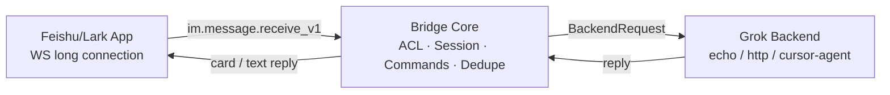

# Feishu / Lark ↔ Grok Bot Bridge

飞书/Lark 自建应用通过 **WebSocket 长连接**（无需公网 IP）接收消息，转发到可插拔的 **Grok Backend**，再以卡片（失败则纯文本）回复。

A production-oriented TypeScript Node.js bridge: Feishu WS → Bridge Core → Grok Backend → Feishu reply.

---

## 架构 Architecture



---

## 功能 Features

- WebSocket 事件订阅（`im.message.receive_v1`），支持单聊 DM 与群聊 `@机器人`
- 多轮会话（按 `chat_id`）、命令：`/help` `/new` `/status` `/whoami` `/stop`
- 后端：`EchoBackend`（冒烟）、`HttpBackend`（Webhook JSON / SSE）、`CursorAgentBackend`（stub）
- 安全：`ALLOW_FROM` **空 = 拒绝所有人**；`ALLOW_CHATS`；群聊 `REQUIRE_MENTION`
- CLI：`doctor` / `start` / `status`

---

## 飞书应用配置（open.feishu.cn）

1. 打开 [飞书开放平台](https://open.feishu.cn)（国际版：[open.larksuite.com](https://open.larksuite.com)）→ **创建企业自建应用**。
2. **凭证与基础信息**：记录 `App ID`、`App Secret` → 填入 `.env` 的 `FEISHU_APP_ID` / `FEISHU_APP_SECRET`。
3. **权限管理**，至少申请并开通：
   - `im:message` / `im:message:send_as_bot`（发送消息）
   - `im:message.group_at_msg` / `im:message.p2p_msg`（接收群 @ / 单聊，以控制台实际权限名为准）
   - `im:chat`（按需）
4. **事件订阅**：
   - 选择 **长连接 / WebSocket** 模式（不是「将事件发送至开发者服务器」HTTP 回调）。
   - 添加事件：`im.message.receive_v1`。
   - 保存后需本地/服务器先跑起本 bridge，再在控制台确认长连接就绪。
5. **机器人**：启用机器人能力；可配置默认名称/描述。
6. **版本管理与发布**：创建版本 → 申请线上发布 → 管理员审批通过后，企业内可用。
7. 把机器人拉进群；单聊可直接搜机器人发消息。
8. 在飞书对机器人发 `/whoami`，把返回的 `open_id` 写入 `ALLOW_FROM`（必填，否则拒绝所有人）。

> 国际版 Lark 将 `FEISHU_DOMAIN=lark`。

---

## 环境变量

复制配置：

```bash
cp .env.example .env
```

| 变量 | 说明 |
|------|------|
| `FEISHU_APP_ID` / `FEISHU_APP_SECRET` | 应用凭证（必填） |
| `FEISHU_DOMAIN` | `feishu`（默认）或 `lark` |
| `ALLOW_FROM` | 用户 `open_id` 白名单，逗号分隔。**空 = 拒绝所有人** |
| `ALLOW_CHATS` | `chat_id` 白名单；空 = 不限制会话（仍受 `ALLOW_FROM` 约束） |
| `REQUIRE_MENTION` | 群聊是否必须 @机器人，默认 `true` |
| `GROK_BACKEND` | `echo` \| `http` \| `cursor-agent` |
| `GROK_BOT_WEBHOOK_URL` | `http` 后端 POST 地址 |
| `GROK_BOT_WEBHOOK_TOKEN` | 可选 Bearer Token |
| `GROK_HTTP_TIMEOUT_MS` | HTTP 超时，默认 120000 |
| `SESSION_MAX_HISTORY` | 每会话保留历史条数 |
| `DEDUPE_TTL_MS` | 事件去重 TTL |
| `LOG_LEVEL` | `debug` \| `info` \| `warn` \| `error` |

密钥只来自环境变量；日志中密钥会被脱敏（`***`）。

---

## 快速开始

```bash
cd /workspace/feishu-grok-bridge   # or your clone path
npm install
npm test
npm run doctor          # 检查缺失配置 / 探测 tenant_access_token
# 编辑 .env 后：
npm run dev             # tsx watch → start
# 或
npm run build && npm start
```

### EchoBackend 冒烟

```bash
# .env
GROK_BACKEND=echo
ALLOW_FROM=ou_xxxxxxxx   # 从 /whoami 获取
FEISHU_APP_ID=...
FEISHU_APP_SECRET=...

npm run doctor
npm run dev
```

在飞书对机器人发：`你好` 或 `/help`。应收到带 session 元数据的 Echo 卡片回复。

### HttpBackend 契约（curl）

Bridge 会 `POST` 到 `GROK_BOT_WEBHOOK_URL`：

```bash
curl -sS -X POST "$GROK_BOT_WEBHOOK_URL" \
  -H 'content-type: application/json' \
  -H "authorization: Bearer $GROK_BOT_WEBHOOK_TOKEN" \
  -d '{
    "sessionId": "sess_xxx",
    "chatId": "oc_xxx",
    "userId": "ou_xxx",
    "text": "用户输入",
    "history": [
      {"role": "user", "content": "上一轮"},
      {"role": "assistant", "content": "上一答"}
    ]
  }'
```

期望响应：

- JSON：`{"reply":"……"}`（也接受 `message` 字段）
- 或 SSE：`data: {"reply":"……"}` / `data: {"delta":"…"}` 流式拼接

示例本地假服务：

```bash
npx --yes http-echo-server  # 或任意返回 {"reply":"ok"} 的 stub
# GROK_BACKEND=http
# GROK_BOT_WEBHOOK_URL=http://127.0.0.1:8787/turn
```

最小 Node stub：

```js
import http from 'node:http';
http.createServer(async (req, res) => {
  const chunks = [];
  for await (const c of req) chunks.push(c);
  const body = JSON.parse(Buffer.concat(chunks).toString() || '{}');
  res.setHeader('content-type', 'application/json');
  res.end(JSON.stringify({ reply: `got: ${body.text}` }));
}).listen(8787, () => console.log('webhook :8787'));
```

---

## 飞书命令

| 命令 | 作用 |
|------|------|
| `/help` | 帮助 |
| `/new` | 新会话（清空历史） |
| `/status` | Bridge + 本会话状态 |
| `/whoami` | 显示 `open_id` / `chat_id` |
| `/stop` | 暂停本会话（`/new` 恢复） |

---

## 目录结构

```
feishu-grok-bridge/
├── src/
│   ├── backend/          # GrokBackend · Echo · Http · CursorAgent stub
│   ├── cli/              # doctor · start · status
│   ├── core/             # session · acl · commands · dedupe · concurrency · bridge
│   ├── feishu/           # auth · ws · message · mention
│   ├── im/               # 未来多 IM 适配（钉钉 stub）
│   ├── config.ts
│   ├── logger.ts
│   └── index.ts
├── tests/
├── .env.example
├── docker-compose.yml
├── package.json
└── tsconfig.json
```

---

## Scripts

| Script | 说明 |
|--------|------|
| `npm run dev` | 开发热重载启动 |
| `npm start` | 编译后启动 |
| `npm test` | Vitest 单元测试 |
| `npm run doctor` | 配置体检 |
| `npm run build` | `tsc` |

---

## 安全说明

- **`ALLOW_FROM` 为空时拒绝所有用户**（fail-closed）。上线前务必用 `/whoami` 填入自己的 `open_id`。
- 群聊默认需要 @机器人（`REQUIRE_MENTION=true`）。
- 不要把 `.env` 提交进 Git；`.gitignore` 已忽略。

---

## License

MIT
